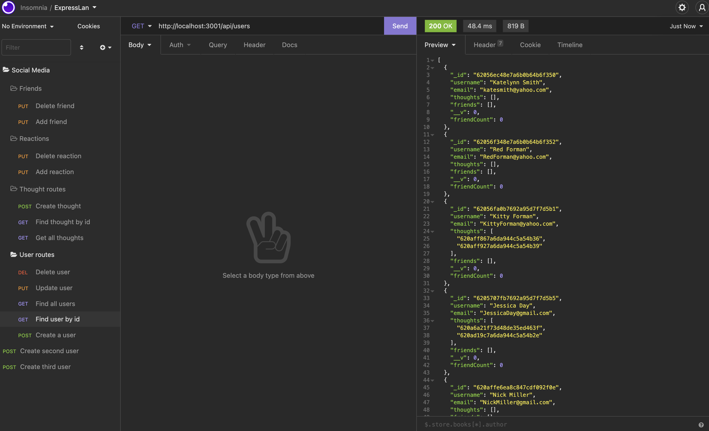

# social-media-api
As a social media startup I want an API for my social network that uses a NoSQL database so that my website can handle large amounts of unstructured data. This project helped me to better understand the syntax, CRUD operations and Insomnia.

## Table of Contents

- [Installation](#installation)
- [Usage](#usage)
- [Credits](#credits)
- [License](#license)

## Installation

I began by creating a uniquely named repository on GitHub and cloned the SSH key to work locally. I then took the starter code and began to flesh out my initial file and folder setup. From there, I utilized the previous lessons to build the code, created my user and thought controllers, models, and routes. I used Insomnia to perform the CRUD operations.

## Usage

    ```md
    
    ```

## Credits
Faran Navazi, my tutor and the previous activites for the NOSQL lesson.

## License

The last section of a high-quality README file is the license. This lets other developers know what they can and cannot do with your project. If you need help choosing a license, refer to [https://choosealicense.com/](https://choosealicense.com/).